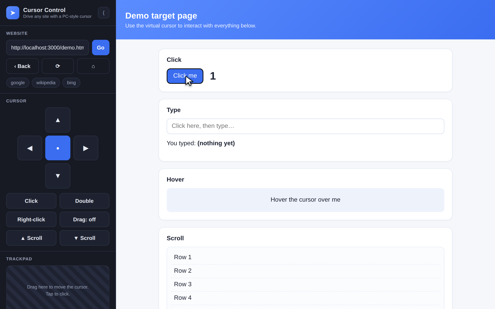

# Cursor Control

Load any website in a panel on the right and drive it with an on‑screen
**virtual cursor** controlled from a sidebar on the left — exactly like a mouse
on a PC.

It exists to **work around touch‑control bugs**: some sites misbehave when you
tap them on a phone or tablet (broken drag handles, sliders that won't move,
hover menus that never open, double‑fire taps). This app intercepts your touches
and replays them into the page as real **mouse / pointer(mouse) events**, so the
site behaves the way it would under a desktop mouse.



**Use it on your iPad in a couple of minutes:**

[](https://render.com/deploy?repo=https://github.com/rubenvoss07-hub/Claude-Design-Fix)

Click the button, choose a login when prompted, and open the resulting
`https://…onrender.com` URL in Safari. (See [Open it on your iPad](#open-it-on-your-ipad-or-any-phonetablet) for details and other options.)

---

## How it works

Two problems make this harder than dropping a site into an `<iframe>`:

1. **Most sites refuse to be embedded** — they send `X-Frame-Options: DENY` or a
   `Content-Security-Policy: frame-ancestors` header.
2. **Even when embedded, you can't touch them** — the browser's same‑origin
   policy forbids a page from reading or dispatching events into a cross‑origin
   iframe.

Cursor Control solves both with a small **rewriting reverse proxy**:

- The Node server fetches the target page and **strips the framing/CSP headers**
  (and equivalent `<meta>` tags), so it can be embedded.
- It serves the page from **our own origin** (`/proxy?url=…`), which makes the
  iframe **same‑origin**. That's what lets the front‑end reach into the document
  and dispatch genuine mouse events.
- It injects a `<base>` tag (so the page's images/CSS/JS load from the real
  site) plus a tiny runtime shim that keeps link clicks, form posts and
  `fetch`/`XHR` calls flowing back through the proxy.

The front‑end then renders a virtual cursor over the iframe. The whole right
pane is a transparent touch surface: your finger never reaches the page
directly, so buggy touch handlers are bypassed. Instead, the app translates your
input into a full, ordered sequence of `pointerover → mouseover → pointerdown →
mousedown → pointerup → mouseup → click` (with `pointerType: "mouse"`).

```
┌──────────────┬───────────────────────────────────────┐
│   SIDEBAR    │              VIEWPORT                  │
│              │   ┌───────────────────────────────┐   │
│  URL bar     │   │  iframe  ← /proxy?url=<site>   │   │
│  D‑pad       │   │          (same‑origin)        │   │
│  Click /     │   │     ▲ transparent overlay     │   │
│  Right‑click │   │       captures your touch     │   │
│  Scroll      │   │     ➤ virtual cursor          │   │
│  Trackpad    │   │       dispatches mouse events │   │
│  Settings    │   └───────────────────────────────┘   │
└──────────────┴───────────────────────────────────────┘
        │                        ▲
        └──── controls cursor ───┘
```

---

## Quick start

```bash
npm install
npm start
# open http://localhost:3000
```

Then type an address (e.g. `google.com`) and press **Go**, or open the built‑in
**demo** page from the welcome screen to try every feature offline.

Requires Node 18+ (uses the built‑in `fetch`). Tested on Node 22.

---

## Using it

**Move the cursor** — any of:
- Drag anywhere on the right pane (it's one big trackpad).
- Drag on the **Trackpad** box in the sidebar (relative, good for precision).
- Tap the **D‑pad** arrows (press and hold to glide).
- Arrow keys on a desktop keyboard.

**Interact:**
| Control | Action |
| --- | --- |
| Tap the page / **Click** / D‑pad centre / Enter | Left click at the cursor |
| **Double** | Double‑click |
| **Right‑click** | Fires `contextmenu` |
| **Drag: off/on** | Press to hold the mouse button down, move, press again to drop (drag & drop, sliders, drawing) |
| **▲/▼ Scroll**, two‑finger drag, mouse wheel | Scroll under the cursor |

**Settings:**
- **Touch mode** — *Direct* (cursor jumps to your finger) or *Trackpad*
  (relative nudging, more precise on small targets).
- **Speed** — cursor / scroll speed.
- **Cursor size**.

Type by clicking an input first (the app focuses it), then use your device
keyboard.

---

## Configuration

| Env var | Default | Purpose |
| --- | --- | --- |
| `PORT` | `3000` | Port to listen on |
| `PUBLIC_ORIGIN` | derived from request | Force the origin used when rewriting links (set this if you run behind a reverse proxy / tunnel) |
| `BASIC_AUTH_USER` / `BASIC_AUTH_PASS` | _unset_ | If both are set, require a username/password (recommended for any public deployment) |

---

## Open it on your iPad (or any phone/tablet)

The app is a small web server, so it has to run *somewhere your iPad can reach*.
Pick whichever fits:

### A. Same Wi‑Fi as a computer (fastest)

1. On a Mac/PC on the same network, run `npm install && npm start`.
2. Find that computer's local IP address:
   - macOS: `ipconfig getifaddr en0`
   - Windows: `ipconfig` → "IPv4 Address"
   (looks like `192.168.x.x`)
3. On the iPad, open Safari and go to `http://<that-ip>:3000`.

Add it to your Home Screen (Share → *Add to Home Screen*) for an app‑like,
full‑screen experience.

### B. Anywhere, always on (cloud — best for real use)

Deploy it once and open the public HTTPS URL from your iPad on any network:

- **Render** (free, easiest): dashboard → **New + → Blueprint** → connect this
  repo → deploy. It uses the included `render.yaml` and gives you a URL like
  `https://cursor-control.onrender.com`.
- **Anything that runs Docker** (Fly.io, Railway, a VPS…): the included
  `Dockerfile` works as‑is.

Because a public URL is an **open proxy**, set `BASIC_AUTH_USER` and
`BASIC_AUTH_PASS` (env vars) so only you can use it. Safari will ask for the
login once and remember it.

> Tip: a cloud host serves over **HTTPS**, which Safari and many target sites
> prefer — so option B tends to load more sites than a plain‑HTTP LAN setup.

---

## Network access / "the site won't load"

The server has to be able to **reach the target site over the network**. If a
site fails to load, it's almost always a network‑policy issue rather than the
app:

- **Corporate / MDM filtering.** A managed device or network may block certain
  hosts. (For example, `example.com` is blocked on some MDM profiles — use a
  reachable site such as `google.com` instead.)
- **Sandboxed / allow‑listed environments.** If you run this inside an
  environment with an egress allow‑list (e.g. Claude Code on the web), only
  allow‑listed hosts are reachable. Add the hosts you need to that
  environment's network egress settings. See
  <https://code.claude.com/docs/en/claude-code-on-the-web>.

The built‑in **demo** page (`/demo.html`) always works because it's served
locally — use it to confirm the cursor itself is functioning.

---

## Limitations

This is a pragmatic proxy, not a perfect browser‑in‑a‑browser:

- **CSS `:hover` effects** can't be triggered by synthetic events (a browser
  security rule). JavaScript hover (`mouseenter`/`mouseover`) **does** fire, so
  most interactive menus still work — but purely CSS‑driven dropdowns may not
  open on hover. Click them instead.
- **WebSockets** aren't proxied, so some real‑time features may not work.
- **Logins / cross‑site auth** are best‑effort. Cookies are rewritten to our
  origin, but OAuth pop‑ups and third‑party SSO flows can break.
- **Heavily‑scripted SPAs** that read `location`/`window.origin` may behave
  oddly because they see the proxy's URL.
- It's an **open proxy** — run it locally for yourself. Don't expose it on the
  public internet without adding authentication and host restrictions.

---

## Project layout

```
server.js          Express app: static UI + the /proxy endpoint
src/proxy.js       Fetches the target, strips headers, rewrites cookies
src/rewrite.js     HTML rewriting + the injected in‑page runtime shim
public/index.html  App shell (sidebar + viewport)
public/styles.css  UI styling
public/app.js      Virtual cursor + input handling + mouse‑event synthesis
public/demo.html   A self‑contained page to try every feature offline
```

## License

MIT
